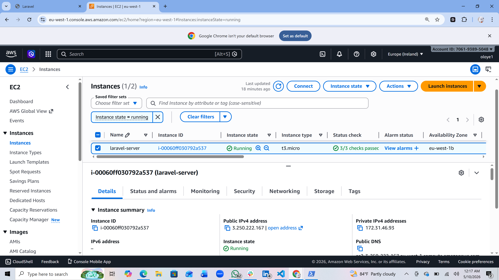
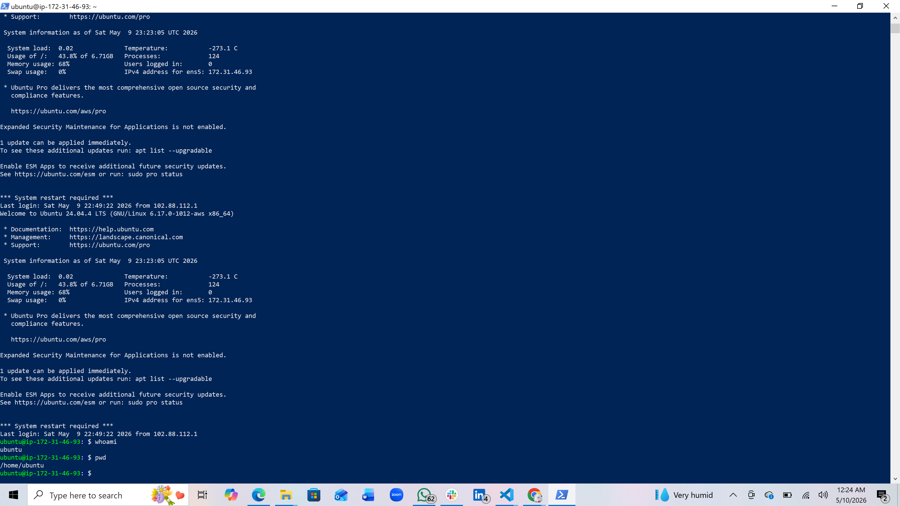
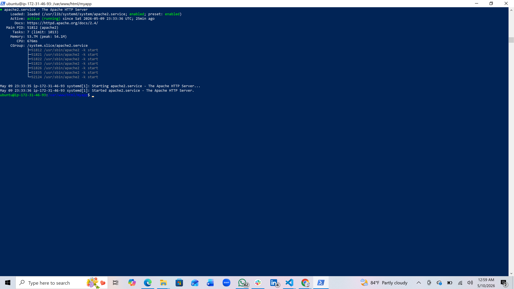
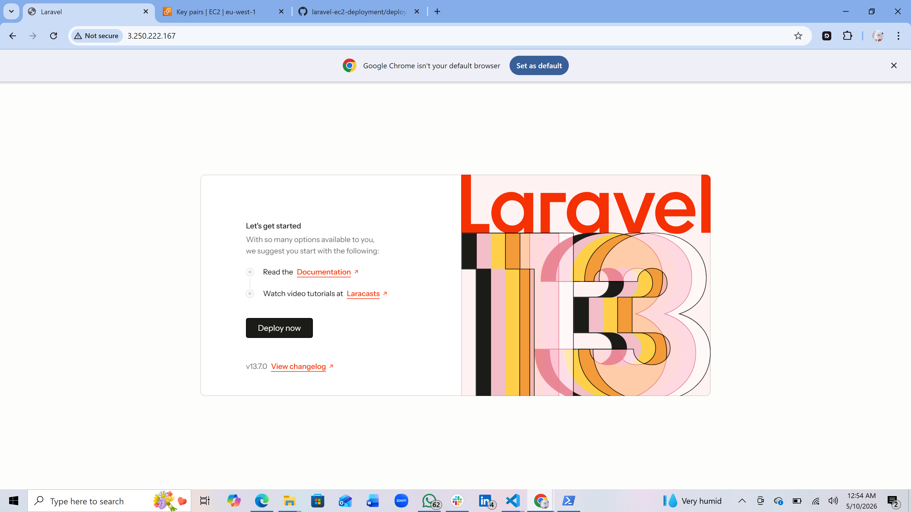

# Laravel Application Deployment on AWS EC2

## Project Overview

This project demonstrates the deployment of a Laravel application on an AWS EC2 Ubuntu server using Apache, PHP, MySQL, Git, and GitHub.

The project was deployed manually to gain practical experience in cloud engineering, Linux server administration, and Laravel production deployment.

---

## Technologies Used

- Laravel
- PHP
- Apache2
- MySQL
- Ubuntu Server
- AWS EC2
- Git & GitHub

---

## Deployment Process

### 1. Launch AWS EC2 Instance

An Ubuntu EC2 instance was launched from the AWS Management Console.



---

### 2. Connect to the Server Using SSH

The server was accessed securely using SSH and a PEM key pair.

```bash
ssh -i your-key.pem ubuntu@your-public-ip
```



---

### 3. Install Apache, PHP, and MySQL

Required packages and dependencies were installed on the Ubuntu server.

```bash
sudo apt update
sudo apt install apache2 php mysql-server
```



---

### 4. Clone Laravel Project from GitHub

The Laravel repository was cloned into the server.

```bash
git clone https://github.com/yourusername/project-name.git
```

---

### 5. Configure Env File

The `.env` file was configured with database credentials and application settings.

---

### 6. Run Database Migration

Database tables were created using Laravel migration commands.

```bash
php artisan migrate
```
---

### 7. Configure Apache Virtual Host

Apache virtual host configuration was updated to point to Laravel's `public` directory.

---

### 8. Final Application Output

The Laravel application was successfully deployed and accessed through the browser.



---

## Author

Developed and deployed by [Feyiwaves]